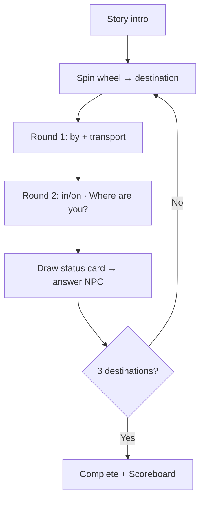

# PRD：Level 1 — Transport & Status（出發與突發狀況）

**更新日期**：2026-05-19  
**遊戲標題（UI）**：Level 1: Departure & Surprises / ✈️ Transport & Status

---

## 1. 專案概述

| 項目 | 內容 |
|------|------|
| **產品名稱** | Transport & Status |
| **實作路徑** | [`apps/grammar-games/traveler-quest/level1-journey/`](../level1-journey/) |
| **主程式** | [`level1-journey/src/main.ts`](../level1-journey/src/main.ts) |
| **頁面** | [`level1-journey/index.html`](../level1-journey/index.html) |
| **文法焦點** | How do you go…? / 交通介系詞 **by**、**in/on**；How are you? / How was the trip? |
| **NPC** | Tour Guide（`guide`） |
| **過關條件** | 完成 **3 個目的地**（每站：交通 by → 交通 in/on → 狀態卡） |

---

## 2. 題庫位置

### 2.1 關卡執行時題庫（權威來源）

題目與驗證規則寫在程式內，修改玩法請改下列常數：

| 資料 | 檔案 | 常數名稱 |
|------|------|----------|
| 轉盤目的地與 NPC 問句 | `level1-journey/src/main.ts` | `DESTINATIONS` |
| 狀態卡（表情／預期回答） | `level1-journey/src/main.ts` | `STATUS_CARDS` |

### 2.2 延伸題庫 CSV（選擇題模組）

| 檔案 | 連結 |
|------|------|
| WHQA Traveler Level 1 MC | [`Content/grammar/Grammar-Basic/WHQA+Dummy Subject/WHQA-Traveler-Level1-MC.csv`](../../../../Content/grammar/Grammar-Basic/WHQA+Dummy%20Subject/WHQA-Traveler-Level1-MC.csv) |

- **GrammarPoint** 含 `WHQA_How_Transport`、`WHQA_How_Be_State` 等。
- 可透過文法大廳其他入口之 **Multiple Choice**（`apps/grammar-games/finish/multiple-choice/?unit=…`）練習；**與本關轉盤流程分離**。

---

## 3. 開場故事（Intro）

- 進入關卡後先顯示 **故事白卡**（`showIntro()`），上方無 Tour Guide 對話框、無轉盤。
- 說明：導遊帶隊出發前，需練習交通（by / in·on）與狀態問答（How are you? / How was the trip?）。
- 按鈕：**Start — spin the wheel!** → 進入轉盤階段（`showSpinPhase()`）。
- 樣式：`story-intro-panel`（與 Level 2／3 相同排版，主色為 sky 藍）。
- 重新開始（Scoreboard Restart）亦回到 Intro。

---

## 4. 核心玩法

### 4.1 總流程

### 4.2 轉盤

- 從 `DESTINATIONS` 抽一個尚未完成的 destination（已完成者自轉盤池移除）。
- 例：school, New York, the library, work, Taipei…

### 4.3 交通兩階段（同一目的地）

| 順序 | 模式 | NPC | 學生任務 | 黃色提示 |
|------|------|-----|----------|----------|
| 1 | `by` | 唸出 `Destination.question`（如 How do you go to school?） | 回答 **by + 交通工具**（不可加 a/the） | This round: use **by** |
| 2 | `in_on` | **Where are you?** + 副標顯示上一題 by 回答 | 回答 **in/on**（如 I'm on the bus） | This round: use **in or on** |

- 通過 by 後會記住 `lastByTransportAnswer`，供 Where are you? 階段參考。

### 4.4 狀態卡

- 隨機抽一張 `STATUS_CARDS`（Happy / Sick / Terrible / Tired）。
- NPC 依卡片問 **How are you?** 或 **How was the trip to [destination]?**
- 學生依卡片語意手動輸入（驗證 `expectedPatterns`）。

### 4.5 輸入與回饋

- 全程 **手動輸入英文**，無四選一。
- 錯誤顯示具體 feedback（如 by 不可加冠詞、本回合只能用 in/on 等）。

---

## 5. UI／UX 要點

- 開場：`story-intro-panel` 大字距分段；按鈕「Start — spin the wheel!」
- 頂部進度：Intro 時為 `Departure briefing`；遊戲中為 `Destination n / 3`
- 轉盤 SVG 多字 destination 以縮寫顯示於扇區
- 返回：[文法大廳 WH 分頁](/apps/grammar-hub/index.html?tab=wh)

---

## 6. 技術規格

| 項目 | 說明 |
|------|------|
| 框架 | Vite + TypeScript |
| 追蹤單元 | `WHQA-Traveler-Level1-Journey` |
| 通關 key | `traveler_quest_level1_complete` |
| 成績板 | `GrammarScoreboard` + `GrammarDataTracker` |
| 登入 | 未登入則 alert 並導回文法大廳 |

---

