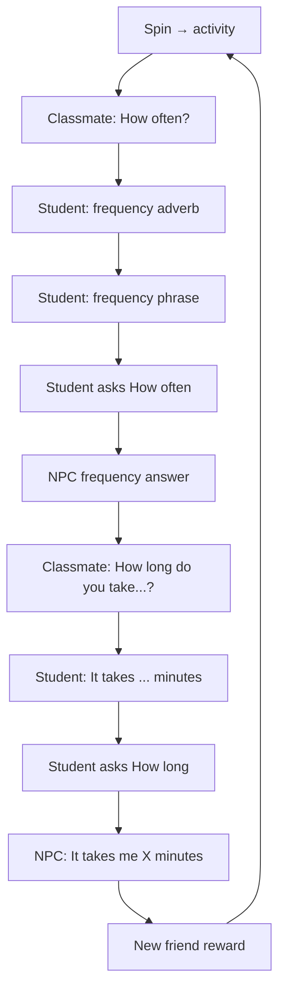

# PRD：Level 2 — New Class Icebreakers（新班破冰）

**更新日期**：2026-05-19  
**遊戲標題（UI）**：🎒 New Class Icebreakers

---

## 1. 專案概述

| 項目 | 內容 |
|------|------|
| **產品名稱** | New Class Icebreakers |
| **實作路徑** | [`apps/grammar-games/traveler-quest/level2-itinerary/`](../level2-itinerary/) |
| **主程式** | [`level2-itinerary/src/main.ts`](../level2-itinerary/src/main.ts) |
| **頁面** | [`level2-itinerary/index.html`](../level2-itinerary/index.html) |
| **情境** | 新班級第一天，與同學轉盤選話題，練 **How often** 與 **How long** |
| **NPC** | Classmate（`classmate`，🎒） |
| **過關條件** | 完成 **3 輪**完整對話；每輪結束獲得 **1 位新朋友** |

---

## 2. 題庫位置

### 2.1 關卡執行時題庫（權威來源）

| 資料 | 檔案 | 常數名稱 |
|------|------|----------|
| 轉盤活動（8 項） | `level2-itinerary/src/main.ts` | `WHEEL_ACTIVITIES` |
| 新朋友名單（每輪解鎖） | `level2-itinerary/src/main.ts` | `NEW_CLASSMATES` |

`WHEEL_ACTIVITIES` 範例：play tennis, study English, be sick, go to the library, watch TV, do homework, play basketball, read books。

### 2.2 延伸題庫 CSV（重組／命題參考）

| 檔案 | 連結 |
|------|------|
| WHQA Traveler Level 2 Unscramble | [`Content/grammar/Grammar-Basic/WHQA+Dummy Subject/WHQA-Traveler-Level2-Unscramble.csv`](../../../../Content/grammar/Grammar-Basic/WHQA+Dummy%20Subject/WHQA-Traveler-Level2-Unscramble.csv) |

- 含 `WHQA_How_Often_*`、`WHQA_How_Long_*` 等 GrammarPoint。
- 可經 `finish/unscramble` 載入練習；**本關為即時輸入對話，不讀此 CSV**。

### 2.3 NPC 頻率／時間回答

- **How often**：`pickNpcFreqAnswer()` 自內建句池隨機（程式內）。
- **How long**：`npcMinutes` 為 5–120 之隨機整數（分鐘）。

---

## 3. 開場故事（Intro）

- 故事卡說明：新班、轉盤選話題、How often / How long 輪流練習。
- 開場為故事白卡 + **Start — spin for a topic!** 按鈕（無上方 NPC 對話框）。

---

## 4. 單輪流程（共 3 輪）

### 4.1 How often

| 步驟 | 說明 | 驗證重點 |
|------|------|----------|
| Classmate 問 | `howOftenQuestion(act)` | — |
| 學生答 1 | 頻率**副詞**（usually, never…） | 不可同時用片語句型 |
| 學生答 2 | 頻率**片語**（every day, twice a week…） | 須含片語 |
| 學生問 | 只顯示轉盤主題 + placeholder `How often...?` | 須含 how often + 活動 |
| Classmate 答 | 顯示 `npcFreqAnswer` | — |

### 4.2 How long

| 步驟 | 說明 | 驗證重點 |
|------|------|----------|
| Classmate 問 | 如 `How long do you take to watch TV?` | — |
| 學生答 | `It takes … minutes to …` | 時間須用**英文數字**（thirty minutes）；**不可**用阿拉伯數字（30 minutes） |
| 學生問 | 轉盤主題 + placeholder `How long does it take .....?` | 須含 how long does it take + 活動關鍵字 |
| Classmate 答 | `It takes me {npcMinutes} minutes to {verb}.` | — |

### 4.3 新朋友獎勵

- 每輪結束：**You made a new friend!**（頭像 + 英文名）。
- 頁首 **Friends** 列顯示已收集頭像與 `n/3`。
- 再進入下一輪轉盤或通關。

---

## 5. UI／UX 要點

- 黃色 `round-hint-box`：回合提示（打字機風格）。
- 轉盤：多字活動以 `<tspan>` 換行，不截斷。
- 介面語言：**英文**（含錯誤訊息）。
- 故事開場／按鈕：加大行距、換行（`story-intro-panel` 樣式）。

---

## 6. 技術規格

| 項目 | 說明 |
|------|------|
| `PASS_ROUNDS` | 3 |
| 追蹤單元 | `WHQA-Traveler-Level2-Schedule` |
| 通關 key | `traveler_quest_level2_complete` |
| 轉盤 | 已完成活動自池中移除，抽完可重置池 |
